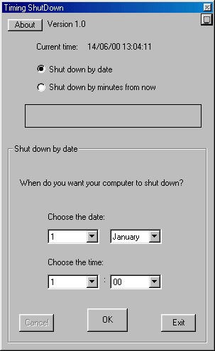



## Timing ShutDown v1\.0

### Description

Ever wanted your computer to shut down automatically? Now you can! With this application you can, for example, put your computer on defragment at night, set the time you want your computer to shut down and go to sleep!

Or you can download something at night or while you are not at home, and shut down your computer by date or minutes from now!

Amazing!
 
### More Info
 

             |
---                |---
**Submitted On**   |2000-05-01 22:56:38
**By**             |[Yossi R](https://github.com/Planet-Source-Code/PSCIndex/blob/master/ByAuthor/yossi-r.md)
**Level**          |Intermediate
**User Rating**    |5.0 (10 globes from 2 users)
**Compatibility**  |VB 3\.0, VB 4\.0 \(16\-bit\), VB 4\.0 \(32\-bit\), VB 5\.0, VB 6\.0
**Category**       |[Complete Applications](https://github.com/Planet-Source-Code/PSCIndex/blob/master/ByCategory/complete-applications__1-27.md)
**World**          |[Visual Basic](https://github.com/Planet-Source-Code/PSCIndex/blob/master/ByWorld/visual-basic.md)
**Archive File**   |[CODE\_UPLOAD67586142000\.zip](https://github.com/Planet-Source-Code/yossi-r-timing-shutdown-v1-0__1-8910/archive/master.zip)

